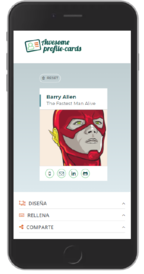
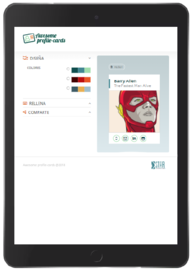

  

  

# **Profile Cards Refactor**

Module 3 Team Project of the Adalab Digital Frontend Development Bootcamp.

This is a profile cards app developed with [](https://html.spec.whatwg.org/) [](https://sass-lang.com/)
[](https://www.w3.org/Style/CSS/) [](https://www.ecma-international.org/ecma-262/) and [](https://es.reactjs.org/)

## **Refactorizadas Team**

This project has been developed by Refactorizadas Team:

- **Emma Cebada:** [@Emma-cebada](https://github.com/Emma-cebada)
- **Ana Guerra:** [@anaguerraabaroa](https://github.com/anaguerraabaroa)
- **Celia Martín:** [@Celiamf](https://github.com/Celiamf)
- **Belén Matilla:** [@BMatillaVaras](https://github.com/BMatillaVaras)
- **Lissandra Méndez:** [@lissms](https://github.com/lissms)

## **Quick start guide**

Instructions to start this project:

## Installation

- Clone repository:

```
git clone [repository]
```

- Install NPM packages and dependencies:

```
npm install
```

- Run project on local server:

```
npm start
```

- **[Project URL](https://anaguerraabaroa.github.io/profile-cards-refactor/#/)** is also available on GitHub Pages.

## **Project features**

- Refactor [](https://www.ecma-international.org/ecma-262/)  [**module 2 project**](https://beta.adalab.es/project-promo-K-module-02-team-05/) with [](https://es.reactjs.org/)

## **Usage**

### **1. App component**

- Render Landing and Card Generator components

```javascript
class App extends React.Component {
  render() {
    return (
      <Switch>
        <Route exact path="/" component={Landing} />
        <Route path="/cardgenerator" component={CardGenerator} />
      </Switch>
    );
  }
}
```

### **2. CardGenerator component**

- Handle app, lifecycle, form fields, api request and localStorage

```javascript
class CardGenerator extends React.Component {
  constructor(props) {
    super(props);

    this.state = {
      palette: "",
      palettes: "",
      fullName: "",
      job: "",
      email: "",
      telephone: "",
      linkedin: "",
      github: "",
      img: "",
      apiSuccess: false,
      apiCardUrl: "",
      apiError: "",
      loading: false,
    };
    this.handleInputChange = this.handleInputChange.bind(this);

    this.handleReset = this.handleReset.bind(this);
    this.sendRequest = this.sendRequest.bind(this);
  }

  handleInputChange = (name, value) => {
    this.setState({
      [name]: value,
    });
    if (value === "paletteBlue") {
      this.setState({
        palette: 1,
      });
    } else if (value === "paletteRed") {
      this.setState({
        palette: 2,
      });
    } else if (value === "paletteGrey") {
      this.setState({
        palette: 3,
      });
    }
  };

  handleReset = () => {
    this.setState({
      palette: "",
      palettes: "",
      fullName: "",
      job: "",
      email: "",
      telephone: "",
      linkedin: "",
      github: "",
      img: "",
    });
  };

  sendRequest = () => {
    this.setState({
      loading: true,
    });
    const apiCard = {
      name: this.state.fullName,
      job: this.state.job,
      phone: this.state.telephone,
      email: this.state.email,
      linkedin: this.state.linkedin,
      github: this.state.github,
      palette: this.state.palette,
      photo: this.state.img,
    };
    sendData(apiCard).then((response) => {
      if (response.success === true) {
        this.setState({
          apiSuccess: true,
          apiCardUrl: response.cardURL,
          apiError: "",
          loading: false,
        });
        console.log(this.state.apiCardUrl);
      } else {
        this.setState({
          apiSuccess: false,
          apiCardUrl: "",
          apiError: response.error,
        });
      }
    });
  };

  componentDidMount() {
    this.getLocalStorage();
  }
  componentDidUpdate() {
    this.setLocalStorage();
  }

  setLocalStorage() {
    const data = JSON.stringify(this.state);
    localStorage.setItem("cardData", data);
  }

  getLocalStorage() {
    const savedData = JSON.parse(localStorage.getItem("cardData"));
    if (savedData !== null) {
      this.setState({
        palette: savedData.palette,
        palettes: savedData.palettes,
        fullName: savedData.fullName,
        job: savedData.job,
        email: savedData.email,
        telephone: savedData.telephone,
        linkedin: savedData.linkedin,
        github: savedData.github,
        img: savedData.img,
      });
    }
  }

  render() {
    return (
      <>
        <Header />
        <Main
          handleInputChange={this.handleInputChange}
          state={this.state}
          handleReset={this.handleReset}
          sendRequest={this.sendRequest}
        />
        <Footer />
      </>
    );
  }
}
```

### **3. MainSectionCreate component**

- Render Design, Fill and Share components

```javascript
class MainSectionCreate extends React.Component {
  render() {
    return (
      <section className="colapsableForm">
        <Design handleInputChange={this.props.handleInputChange}></Design>
        <Fill
          handleInputChange={this.props.handleInputChange}
          state={this.props.state}
        ></Fill>
        <Share
          sendRequest={this.props.sendRequest}
          state={this.props.state}
        ></Share>
      </section>
    );
  }
}
```

### **4. Info component**

- Render collapsables header

```javascript
class Info extends React.Component {
  render() {
    return (
      <div
        className={`info ${this.props.state}`}
        onClick={this.props.handleClick}
      >
        <i className={`fa ${this.props.icon} info__icons`}></i>
        <h2 className="info__formTitle">{this.props.title}</h2>
        <i className="fa fa-angle-up info__rotate js__rotate"></i>
      </div>
    );
  }
}
```

### **5. Design component**

- Handle Design collapsable and render palettes

```javascript
class Design extends React.Component {
  constructor(props) {
    super(props);
    this.state = {
      onClick: "close",
    };

    this.collapseDesign = this.collapseDesign.bind(this);
  }

  collapseDesign() {
    this.setState((prevState) => ({
      onClick: prevState.onClick === "close" ? "open" : "close",
    }));
  }

  render() {
    return (
      <article className="border">
        <Info
          state={this.state.onClick}
          icon="fa-object-ungroup"
          title="Diseña"
          handleClick={this.collapseDesign}
        ></Info>
        <div className={`design js__displayNone ${this.state.onClick}`}>
          <h3 className="design__title">Colores</h3>
          <div>
            <Palettes
              divClass="blue"
              inputClass="js-checkedBlue"
              id="paletteBlue"
              classColor1="box1"
              classColor2="box2"
              classColor3="box3"
              handleInputChange={this.props.handleInputChange}
            />
            <Palettes
              divClass="red"
              inputClass="js-checkedRed"
              id="paletteRed"
              classColor1="box4"
              classColor2="box5"
              classColor3="box6"
              handleInputChange={this.props.handleInputChange}
            />
            <Palettes
              divClass="grey"
              inputClass="js-checkedGrey"
              id="paletteGrey"
              classColor1="box7"
              classColor2="box8"
              classColor3="box9"
              handleInputChange={this.props.handleInputChange}
            />
          </div>
        </div>
      </article>
    );
  }
}
```

### **6. Palettes component**

- Handle selected palette and render individual palette

```javascript
class Palettes extends React.Component {
  constructor(props) {
    super(props);
    this.handleChange = this.handleChange.bind(this);
  }
  handleChange = (ev) => {
    this.props.handleInputChange(ev.target.name, ev.target.value);
  };

  render() {
    return (
      <div className={`design__colors ${this.props.divClass}`}>
        <input
          className={`design__colors--check ${this.props.inputClass}`}
          id={this.props.id}
          type="radio"
          value={this.props.id}
          name="palettes"
          onChange={this.handleChange}
        />
        <div className={`design__colors--box ${this.props.classColor1}`}></div>
        <div className={`design__colors--box ${this.props.classColor2}`}></div>
        <div className={`design__colors--box ${this.props.classColor3}`}></div>
      </div>
    );
  }
}
```

### **7. Fill component**

- Handle Fill collapsable and render form inputs

```javascript
class Fill extends React.Component {
  constructor(props) {
    super(props);
    this.state = {
      onClick: "close",
    };

    this.collapseFill = this.collapseFill.bind(this);
  }

  collapseFill() {
    this.setState((prevState) => ({
      onClick: prevState.onClick === "close" ? "open" : "close",
    }));
  }

  render() {
    return (
      <article className="border">
        <Info
          state={this.state.onClick}
          icon="fa-keyboard-o"
          title="Rellena"
          handleClick={this.collapseFill}
        ></Info>
        <form
          action=""
          method="post"
          className={`fill js__displayNone ${this.state.onClick}`}
        >
          <FormItem
            name="fullName"
            title="Nombre completo"
            placeholder="Ej: Barry Allen"
            type="text"
            value={this.props.state.fullName}
            handleInputChange={this.props.handleInputChange}
          ></FormItem>
          <FormItem
            name="job"
            title="Puesto"
            placeholder="Ej: The fastest man alive"
            type="text"
            value={this.props.state.job}
            handleInputChange={this.props.handleInputChange}
          ></FormItem>
          <CardImage
            handleInputChange={this.props.handleInputChange}
            img={this.props.state.img}
          />
          <FormItem
            name="email"
            title="E-mail"
            placeholder="Ej: barryAllen@gmail.com"
            type="email"
            pattern="[a-z0-9._%+-]+@[a-z0-9.-]+\.[a-z]{2,}$"
            value={this.props.state.email}
            handleInputChange={this.props.handleInputChange}
          ></FormItem>
          <FormItem
            name="telephone"
            title="Teléfono"
            placeholder="Ej: 555-55-55-55"
            type="tel"
            pattern="[0-9]{9}"
            value={this.props.state.telephone}
            handleInputChange={this.props.handleInputChange}
          ></FormItem>
          <FormItem
            name="linkedin"
            title="LinkedIn"
            placeholder="Ej: barryAllen"
            type="text"
            value={this.props.state.linkedin}
            handleInputChange={this.props.handleInputChange}
          ></FormItem>
          <FormItem
            name="github"
            title="GitHub"
            placeholder="Ej: Barry-Allen"
            type="text"
            pattern="@[A-Za-z][0-9]{1,}"
            value={this.props.state.github}
            handleInputChange={this.props.handleInputChange}
          ></FormItem>
        </form>
      </article>
    );
  }
}
```

### **8. FormItem component**

- Handle form inputs and render individual form input

```javascript
class FormItem extends React.Component {
  constructor(props) {
    super(props);
    this.handleChange = this.handleChange.bind(this);
  }
  handleChange = (ev) => {
    this.props.handleInputChange(ev.target.name, ev.target.value);
  };

  render() {
    return (
      <>
        <label htmlFor={this.props.name} className="fill__label">
          {this.props.title}
        </label>
        <input
          className="fill__input"
          placeholder={this.props.placeholder}
          id={this.props.name}
          type={this.props.type}
          name={this.props.name}
          pattern={this.props.pattern}
          value={this.props.value}
          onChange={this.handleChange}
          required
        />
      </>
    );
  }
}
```

### **9. CardImage component**

- Handle get, upload and render image on the profile card

```javascript
class CardImage extends React.Component {
  constructor(props) {
    super(props);
    this.handleCardImg = this.handleCardImg.bind(this);
    this.writeImage = this.writeImage.bind(this);
    this.fakeClick = this.fakeClick.bind(this);
    this.fileInput = React.createRef();
    this.fr = new FileReader();
  }

  writeImage() {
    const url = this.fr.result;
    this.props.handleInputChange("img", url);
  }

  handleCardImg() {
    const file = this.fileInput.current.files[0];
    this.fr.onload = this.writeImage;
    this.fr.readAsDataURL(file);
  }

  fakeClick() {
    this.fileInput.current.click();
  }

  render() {
    return (
      <>
        <label className="fill__label--img" htmlFor="img-selector">
          Imagen de perfil
        </label>
        <div className="fill__wrapper">
          <div className="action">
            <button
              className="action__upload-btn"
              type="button"
              title="Añadir imagen"
              onClick={this.fakeClick}
            >
              Añadir imagen
            </button>
            <input
              type="file"
              name="img-selector"
              id="img-selector"
              accept="image/png, image/jpeg"
              className="action__hiddenField"
              ref={this.fileInput}
              onChange={this.handleCardImg}
            />
          </div>
          <div className="profile">
            <div
              className="profile__preview"
              id="previewImg"
              style={{ backgroundImage: `url(${this.props.img})` }}
            ></div>
          </div>
        </div>
      </>
    );
  }
}
```

### **10. Share component**

- Handle Share collapsable, create profile card link and button to share it on Twitter

```javascript
class Share extends React.Component {
  constructor(props) {
    super(props);
    this.state = {
      onClick: "close",
      createCard: "close",
    };

    this.collapseShare = this.collapseShare.bind(this);
    this.createCard = this.createCard.bind(this);
  }

  collapseShare() {
    this.setState((prevState) => ({
      onClick: prevState.onClick === "close" ? "open" : "close",
    }));
  }

  createCard() {
    this.props.sendRequest();
    this.setState((prevState) => ({
      createCard: prevState.createCard === "close" ? "open" : "close",
    }));
  }

  render() {
    const tweet =
      "Ya tengo mi tarjeta creada en STAR Labs, soy miembro de La Liga de la Justicia";
    const loadingElement =
      this.props.state.loading === true ? <Loading /> : null;
    return (
      <>
        <article className="border">
          <Info
            state={this.state.onClick}
            icon="fa-share-alt"
            title="Comparte"
            handleClick={this.collapseShare}
          ></Info>
          <div className={`share  js__displayNone ${this.state.onClick}`}>
            <i className="fa fa-address-card-o share__icon"></i>
            <button
              className="share__button"
              type="button"
              onClick={this.createCard}
            >
              Crear tarjeta
            </button>
          </div>
        </article>
        <div className={`border sent js__displayNone ${this.state.createCard}`}>
          <h3 className="sent__text section__share--subtitle">
            La tarjeta ha sido creada
          </h3>
          {loadingElement}
          <a
            className="sent__link link--share"
            href={this.props.state.apiCardUrl}
            target="_blank"
            rel="noreferrer"
          >
            {this.props.state.apiSuccess
              ? this.props.state.apiCardUrl
              : this.props.state.apiError}
          </a>
          <a
            href={`https://twitter.com/intent/tweet?text=${tweet}&url=${this.props.state.apiCardUrl}`}
            className="sent__twitter button--share"
            target="_blank"
            rel="noreferrer"
          >
            <i className="fa fa-twitter sent__twitter--icon" aria-hidden="true"></i>
            Compartir en twitter
          </a>
        </div>
      </>
    );
  }
}
```

### **11. MainSectionCard component**

- Render profile card

```javascript
class MainSectionCard extends React.Component {
  render() {
    return (
      <section className="sectionOne">
        <div>
          <button className="sectionOneBtn" onClick={this.props.handleReset}>
            <i className="fa fa-trash-o sectionOneBtn__logo" aria-hidden="true"></i>
            Reset
          </button>
          <div className={`sectionOneCard ${this.props.state.palettes}`}>
            <header className="sectionOneCard__header js-border">
              <h2
                className="sectionOneCard__header--name js__name--Card"
                id="js-fullName-card"
              >
                {this.props.state.fullName || "Barry Allen"}
              </h2>
              <h3 className="sectionOneCard__header--job" id="js-job-card">
                {this.props.state.job || "The Fastest Man Alive"}
              </h3>
            </header>
            <div
              className="profile__image"
              id="profileImg"
              style={{
                backgroundImage: `url(${this.props.state.img || CardImg})`,
              }}
            ></div>
            <nav>
              <ul className="sectionOneCard__nav">
                <CardIcons
                  href={`tel:${this.props.state.telephone}`}
                  id="js-telephone-card"
                  icon="fa-mobile"
                ></CardIcons>
                <CardIcons
                  href={`mailto:${this.props.state.email}`}
                  id="js-mail-card"
                  icon="fa-envelope-o"
                ></CardIcons>
                <CardIcons
                  href={`https://www.linkedin.com/in/${this.props.state.linkedin}`}
                  id="js-linkedin-card"
                  icon="fa-linkedin"
                ></CardIcons>
                <CardIcons
                  href={`https://github.com/${this.props.state.github}`}
                  id="js-github-card"
                  icon="fa-github-alt"
                ></CardIcons>
              </ul>
            </nav>
          </div>
        </div>
      </section>
    );
  }
}
```

### **12. CardIcons component**

- Render social media icons on the profile card

```javascript
class CardIcons extends React.Component {
  render() {
    return (
      <li>
        <a
          href={this.props.href}
          id={this.props.id}
          target="_blank"
          rel="noreferrer"
        >
          <i
            className={`fa ${this.props.icon} sectionOneCard__nav--logos js-socialLogos`}
            aria-hidden="true"
          ></i>
        </a>
      </li>
    );
  }
}
```

## **Folder Structure**

```
Profile Cards Refactor
├── docs
├── node_modules
├── public
├── src
│   ├── components
│   │   ├── Create
│   │   │   ├── CardImage.js
│   │   │   ├── Design.js
│   │   │   ├── Fill.js
│   │   │   ├── FormItem.js
│   │   │   ├── Info.js
│   │   │   ├── Palettes.js
│   │   │   └── Share.js
│   │   ├── App.js
│   │   ├── CardGenerator.js
│   │   ├── CardIcons.js
│   │   ├── Footer.js
│   │   ├── Header.js
│   │   ├── Landing.js
│   │   ├── Loading.js
│   │   ├── Main.js
│   │   ├── MainSectionCard.js
│   │   └── MainSectionCreate.js
│   ├── images
│   │    ├── batman_loading.gif
│   │    ├── Flash.png
│   │    ├── header_logo.png
│   │    ├── landing_desktop.png
│   │    ├── landing_mobile.png
│   │    ├── landing_tablet.png
│   │    ├── logoStarCodingLabs-Blue.svg
│   │    ├── profile_cards_desktop.png
│   │    ├── profile_cards_mobile.png
│   │    ├── profile_cards_tablet.png
│   │    └── tarjetas-molonas.svg
│   ├── services
│   │    └── fetch.js
│   ├── stylesheets
│   │   ├── core
│   │   │   ├── _reset.scss
│   │   │   └── _variables.scss
│   │   ├── layout
│   │   │   ├── _cardIcons.scss
│   │   │   ├── _design.scss
│   │   │   ├── _fill.scss
│   │   │   ├── _footer.scss
│   │   │   ├── _header.scss
│   │   │   ├── _info.scss
│   │   │   ├── _landing.scss
│   │   │   ├── _loading.scss
│   │   │   ├── _main.scss
│   │   │   ├── _mainSectionCard.scss
│   │   │   ├── _mainSectionCreate.scss
│   │   │   ├── _share.scss
│   │   │   └──
│   │   ├── pages
│   │   │   └── _index.scss
│   │   └── App.scss
│   ├── index.js
│   └── reportWebVitals.js
├── .gitignore
├── debug.log
├── LICENSE
├── package-lock.json
├── package.json
└── README.md

```

## **License**

This project is licensed under 
